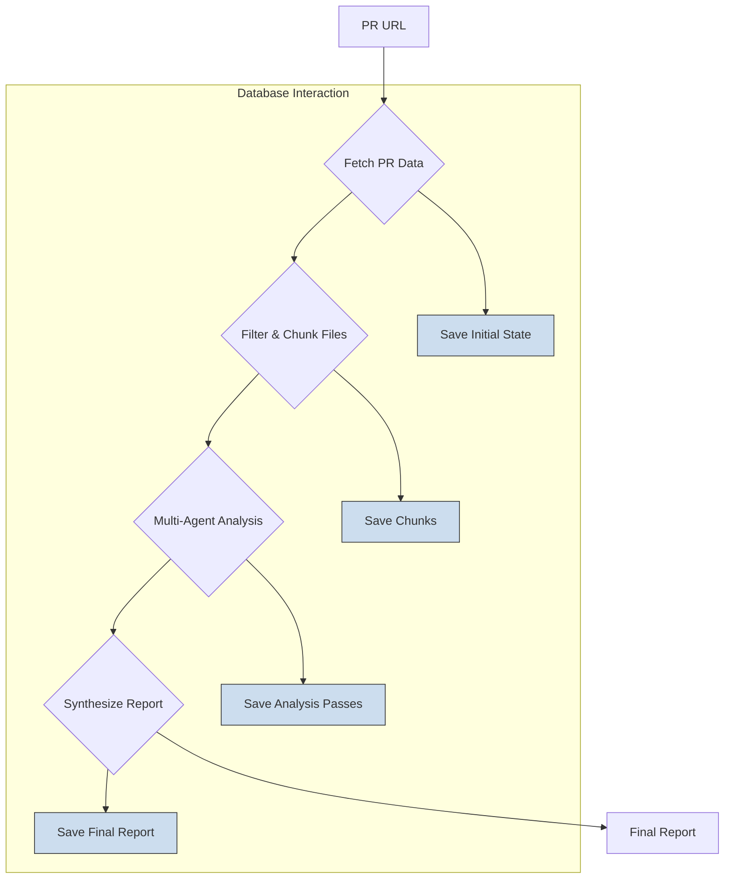

# Hikma-PR: Data Flow Document

*This document, generated by Gemini, details the data flow within the Hikma-PR application, complementing the main Architecture Document.*

## 1. Introduction

Understanding how data moves through the Hikma-PR system is crucial for debugging, extending, and maintaining the application. This document provides a step-by-step breakdown of the data flow, from the moment a user initiates a review to the final report generation. It clarifies the role of each component in processing and transforming the data.

## 2. High-Level Data Flow

The data flow is orchestrated by a stateful graph, which ensures that data from one step is correctly passed to the next. The general flow can be visualized as follows:

## 3. Detailed Step-by-Step Data Flow

Let's trace the data journey when a user runs `hikma review <pr_url>`.

### Step 1: Command Initiation and PR Data Fetching

1.  **Entry Point**: The user executes the command. The `src/index.ts` file, using `commander.js`, captures the PR URL and invokes the `reviewCommandHandler` in `src/commands/review.ts`.

2.  **Task ID Generation**: A unique `taskId` (UUID) is generated to track this specific review process.

3.  **Initial State Persistence**: The `reviewCommandHandler` immediately creates a record in the database via Prisma, saving the `taskId`, `prUrl`, and initial state. This is crucial for the `resume` functionality.

4.  **Workflow Invocation**: The `getAppWithConfig()` function from `src/graph/workflow.ts` is called. This initializes the **LangGraph** `StateGraph` with a specific configuration (e.g., recursion limit).

5.  **Fetching PR Details**: The workflow begins. The first node, `establishContext`, is executed.
    *   **Method**: `getPrDetailsViaCli(prUrl)` from `src/services/githubService.ts`.
    *   **Action**: This function executes the `gh pr view <url> --json ...` shell command.
    *   **Data Output**: It returns a JSON object containing the PR's `title`, `body`, `author`, `state`, etc. This data is added to the `ReviewState` object managed by LangGraph.

### Step 2: Filtering, Diffing, and Chunking

1.  **Get Changed Files**: The next node, `filterFiles`, is triggered.
    *   **Method**: `getChangedFilesViaCli(prUrl)` from `src/services/githubService.ts`.
    *   **Action**: It runs `gh pr diff <url> --name-only` to get a list of all files modified in the PR.
    *   **Data Output**: An array of file paths.

2.  **Fetch Full Diff**: In the same node, `getFullPrDiffViaCli(prUrl)` is called.
    *   **Action**: It executes `gh pr diff <url>` to get the **entire diff** for the PR in a single operation. This is a key optimization to avoid multiple API calls.
    *   **Data Output**: A single, large string containing the complete diff. This is stored in the `ReviewState`.

3.  **Filter Files**: The list of changed files is passed to the `FileFilterService`.
    *   **Method**: `filterFiles(allFiles)` in `src/services/fileFilterService.ts`.
    *   **Action**: It filters out files that shouldn't be analyzed based on the project configuration (e.g., `*.min.js`, `node_modules/**`).
    *   **Data Output**: A cleaned list of file paths to be analyzed.

4.  **Chunking**: For each file in the filtered list, the `setupFileChunks` node is executed.
    *   **Method**: `chunkFileDiff(filePath, diffContent)` in `src/services/chunkService.ts`.
    *   **Action**: The service first extracts the relevant portion of the diff for the specific file from the full diff string (a local operation). Then, it breaks this file-specific diff into smaller, semantically-aware `ChunkInfo` objects. This ensures that each chunk sent to the LLM is below its token limit.
    *   **Data Output**: An array of `ChunkInfo` objects, each containing a piece of the diff, file path, and contextual information. These are saved to the database.

### Step 3: Multi-Pass LLM Analysis

1.  **Chunk Analysis**: The `analyzeChunk` node processes each chunk.
    *   **Method**: `analyzeChunk(chunk)` in `src/services/analysisService.ts`.
    *   **Action**: This is a critical step. The `AnalysisService` performs a **4-pass analysis** on the chunk. It sequentially calls an LLM with the same chunk but with four different specialized prompts (defined in `src/prompts/templates.ts`):
        1.  `SYNTAX_LOGIC_TEMPLATE`
        2.  `SECURITY_PERFORMANCE_TEMPLATE`
        3.  `ARCHITECTURE_DESIGN_TEMPLATE`
        4.  `TESTING_DOCS_TEMPLATE`
    *   **LLM Call**: The actual call to the LLM is made by the `UniversalLLMClient` (`src/services/universalLLMClient.ts`), which sends the generated prompt to a configured local LLM server (e.g., LM Studio).
    *   **Data Output**: The results of the four passes are stored as `AnalysisPass` objects in the database, linked to the chunk.

### Step 4: Synthesis and Final Report

1.  **File-Level Synthesis**: Once all chunks for a file have been analyzed, the `synthesizeFile` node is executed.
    *   **Method**: `synthesizeFileAnalysis(filePath, chunkAnalyses)` in `src/services/analysisService.ts`.
    *   **Action**: It gathers all the `AnalysisPass` results for the chunks of a single file and sends them to the LLM with a `FILE_SYNTHESIS_TEMPLATE`. This asks the LLM to create a cohesive summary for the entire file.
    *   **Data Output**: A `FileAnalysisResult` object containing the synthesized summary.

2.  **Final Report Synthesis**: After all files have been synthesized, the `finalSynthesis` node runs.
    *   **Method**: `synthesizeReport(state)` in `src/services/llmService.ts` (legacy) or a similar synthesis function in `AnalysisService`.
    *   **Action**: It collects all the `FileAnalysisResult` objects and sends them to the LLM with the main `SYNTHESIS_TEMPLATE`. This final prompt asks the LLM to act as the `hikmapr` agent and generate the final, user-facing report.
    *   **Data Output**: The final markdown report string.

3.  **Saving the Report**: The `reviewCommandHandler` receives the final report string and saves it to a markdown file in the `reports/` directory.

## 4. The Role of LangGraph in the Data Flow

**LangGraph** is the engine that drives this entire process. It doesn't perform the business logic itself, but it orchestrates the flow of data between the nodes (the services and methods described above).

-   **State Management**: LangGraph maintains the `ReviewState` object. Each node receives the current state, performs its task, and returns data that updates the state. For example, the `filterFiles` node adds the `filtered_files` and `full_pr_diff` to the state.
-   **Conditional Routing**: LangGraph uses conditional edges to decide the next step. For instance, after `filterFiles`, the `shouldContinueFileProcessing` router checks if there are any files in the `files_to_process` queue. If yes, it routes to `setupFileChunks`; if no, it routes directly to `finalSynthesis`.
-   **Resilience**: Because the state is persisted in the database at each step, if the process fails, the `resume` command can restart the graph from the exact state where it left off, preventing the need to re-run expensive operations.

## 5. Key Data Models (`src/types/analysis.ts`)

-   **`ReviewState`**: The central object managed by LangGraph. It holds all the data for an in-progress review, including the PR details, file lists, chunk queues, and analysis results.
-   **`ChunkInfo`**: Represents a single piece of a file's diff that is sent to the LLM. It contains the `diff_content` and metadata like `file_path` and `size_tokens`.
-   **`AnalysisPass`**: Stores the result of one of the four analysis passes for a single chunk. It includes the raw `analysis_result` from the LLM, the extracted `risk_level`, and lists of `issues_found` and `recommendations`.
-   **`FileAnalysisResult`**: Contains the synthesized review for a single file, created by combining the analyses of all its chunks.

This structured data flow, orchestrated by LangGraph and persisted via Prisma, is what gives Hikma-PR its power, resilience, and depth of analysis.
