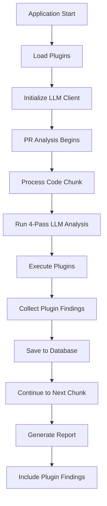

# Plugin Architecture Documentation

**Goal:** Enable extensible analysis capabilities through LLM-powered plugins that can be added without modifying core application code.

---

## 🏗️ **Architecture Overview**

The plugin system provides a hybrid analysis approach combining fast regex-based checks with sophisticated LLM-powered analysis. Plugins are automatically loaded, executed during code analysis, and their findings are stored in the database and included in reports.

---

## 📋 **Core Components**

### **1. Plugin Interface (Contract Definition)**

**File:** `src/types/plugins.ts`

**Key Interfaces:**

```typescript
interface PluginAnalysisInput {
  filePath: string;
  chunkContent: string;
  llmClient?: LLMClient; // LLM client for advanced analysis
}

interface PluginFinding {
  line?: number;
  message: string;
  severity: 'info' | 'warning' | 'error';
  pluginId: string;
  pluginName: string;
}

interface HikmaPlugin {
  id: string;
  name: string;
  description: string;
  hooks: PluginHook[];
  usesLLM?: boolean; // Indicates LLM requirement
  execute: (input: PluginAnalysisInput) => Promise<PluginAnalysisOutput>;
}
```

### **2. Plugin Service (Orchestration)**

**File:** `src/services/pluginService.ts`

**Key Features:**
- **Automatic Plugin Discovery**: Scans `src/plugins/` for `.plugin.ts` files
- **LLM Client Injection**: Provides LLM access to plugins that need it
- **Error Isolation**: Plugin failures don't crash the main workflow
- **Hook-Based Execution**: Plugins subscribe to specific lifecycle events

**Methods:**
```typescript
loadPlugins(): Promise<void>           // Load and validate plugins
runPlugins(hook, input): Promise<PluginFinding[]>  // Execute plugins for hook
setLLMClient(client): void            // Inject LLM client
```

### **3. Database Integration**

**Schema:** `prisma/schema.prisma`

```prisma
model PluginFinding {
  id          String   @id @default(cuid())
  reviewId    String
  chunkId     String
  pluginId    String
  pluginName  String
  message     String
  severity    String   // info, warning, error
  line        Int?
  createdAt   DateTime @default(now())
  
  // Relationships
  review      Review        @relation(fields: [reviewId], references: [id])
  chunk       ChunkAnalysis @relation(fields: [chunkId], references: [chunkId])
}
```

**Benefits:**
- Persistent storage of plugin findings
- Query capabilities for reporting
- Historical analysis data
- Relationship tracking with reviews and chunks

---

## 🔌 **Available Plugins**

### **1. 🔍 Code Smell Detector** (`codeSmell.plugin.ts`)
- **Purpose**: Detects anti-patterns and code smells
- **Hybrid Analysis**: Regex + LLM-powered detection
- **Quick Checks**: Magic numbers, console statements, TODO comments
- **LLM Analysis**: Complex patterns, duplication, naming issues

### **2. ⚛️ React Best Practices** (`reactBestPractices.plugin.ts`)
- **Purpose**: Validates React/JSX best practices
- **File Filtering**: Only analyzes React components
- **Quick Checks**: Missing keys, direct DOM manipulation, inline styles
- **LLM Analysis**: Hooks violations, performance issues, accessibility

### **3. 📘 TypeScript Analyzer** (`typescript.plugin.ts`)
- **Purpose**: Ensures TypeScript type safety
- **File Filtering**: `.ts/.tsx` files only
- **Quick Checks**: `any` usage, `@ts-ignore`, non-null assertions
- **LLM Analysis**: Type safety, generics, interface design

### **4. 🔒 Security Analyzer** (`security.plugin.ts`)
- **Purpose**: Identifies security vulnerabilities
- **Quick Checks**: Hardcoded secrets, SQL injection patterns, eval usage
- **LLM Analysis**: Complex security patterns, authentication issues

---

## 🔄 **Plugin Execution Flow**



### **Detailed Flow:**

1. **Plugin Loading** (`src/index.ts`)
   ```typescript
   const pluginService = new PluginService(path.join(__dirname, 'plugins'));
   pluginService.loadPlugins();
   ```

2. **LLM Integration** (`src/services/analysisService.ts`)
   ```typescript
   const pluginFindings = await this.pluginService.runPlugins('onChunkAnalysis', {
     filePath: chunk.file_path,
     chunkContent: chunk.diff_content,
     llmClient: this.llmClient // LLM client injection
   });
   ```

3. **Database Storage** (`src/graph/workflow.ts`)
   ```typescript
   for (const finding of chunkAnalysis.plugin_findings) {
     await prisma.pluginFinding.create({
       data: {
         reviewId: state.task_id,
         chunkId: currentChunk.id,
         pluginId: finding.pluginId,
         pluginName: finding.pluginName,
         message: finding.message,
         severity: finding.severity,
         line: finding.line || null
       }
     });
   }
   ```

4. **Report Generation** (`src/commands/review.ts`)
   ```typescript
   const pluginFindings = await prisma.pluginFinding.findMany({
     where: { reviewId: taskId, chunk: { filePath: fileName } },
     orderBy: [{ line: 'asc' }, { severity: 'desc' }]
   });
   ```

---

## 🛠️ **Creating Custom Plugins**

### **1. Use the Template**
Copy `src/plugins/template.plugin.ts` and modify:

```typescript
const myPlugin: HikmaPlugin = {
  id: 'my-custom-plugin',
  name: 'My Custom Plugin',
  description: 'What this plugin does',
  hooks: ['onChunkAnalysis'],
  usesLLM: true, // Set to false if no LLM needed
  async execute(input: PluginAnalysisInput): Promise<PluginAnalysisOutput> {
    const findings: PluginFinding[] = [];
    
    // Quick regex checks (always run)
    if (/pattern/.test(input.chunkContent)) {
      findings.push({
        line: 1,
        message: 'Issue found',
        severity: 'warning',
        pluginId: this.id,
        pluginName: this.name,
      });
    }
    
    // LLM-powered analysis (if available)
    if (input.llmClient) {
      const prompt = `ANALYZE: ${input.chunkContent}`;
      const response = await input.llmClient.generate(prompt);
      // Parse response and add findings
    }
    
    return { findings };
  },
};
```

### **2. LLM Prompt Design**
Use structured prompts for consistent parsing:

```typescript
const CUSTOM_PROMPT = `
ANALYZE: Your specific concern

FILE: {filePath}
CODE: {chunkContent}

RESPOND IN THIS FORMAT ONLY:
CATEGORY1: [findings or "None"]
CATEGORY2: [findings or "None"]

Focus on:
- Specific thing 1
- Specific thing 2
`;
```

### **3. File Type Filtering**
Only analyze relevant files:

```typescript
const shouldAnalyze = /\.(js|ts|jsx|tsx)$/.test(input.filePath) ||
                     input.chunkContent.includes('specific-pattern');
```

---

## 📊 **Plugin Performance & Optimization**

### **Hybrid Analysis Strategy**
- **Regex Checks**: Fast, always executed (~1ms per chunk)
- **LLM Analysis**: Sophisticated, executed when LLM available (~2-3s per chunk)
- **Graceful Degradation**: Works without LLM, enhanced with LLM

### **Response Optimization**
LLM responses are automatically constrained:
```typescript
// Automatic constraints added to all LLM requests
CONSTRAINTS:
- Be concise and direct
- Use bullet points, not paragraphs
- Maximum 200 words total
- Focus on actionable items only
```

### **Database Efficiency**
- Indexed queries for fast report generation
- Relationship-based data organization
- Automatic cleanup with cascade deletes

---

## 📈 **Report Integration**

Plugin findings appear in reports with enhanced formatting:

```markdown
### 🔌 Plugin Analysis Results

**Summary:** 🚨 0 errors • ⚠️ 2 warnings • ℹ️ 1 info

#### 🔍 Code Smell Detector

1. ⚠️ **Potential magic number detected. Consider using named constants.** *(Line 2)*

2. ⚠️ **Long method detected. Consider breaking into smaller functions.** *(Line 15)*

#### 📘 TypeScript Analyzer

1. ℹ️ **Function missing explicit return type annotation.** *(Line 24)*

---
```

**Features:**
- **Severity-based organization**: Errors → Warnings → Info
- **Plugin-specific icons**: Visual identification
- **Line number references**: Easy navigation
- **Summary statistics**: Quick overview

---

## 🔧 **Configuration & Deployment**

### **Plugin Loading**
Plugins are automatically discovered and loaded:
- File pattern: `*.plugin.ts` or `*.plugin.js`
- Location: `src/plugins/` directory
- Validation: Interface compliance checking
- Error handling: Failed plugins don't break the system

### **LLM Integration**
- **Automatic injection**: LLM client provided to plugins that need it
- **Provider agnostic**: Works with Ollama, LM Studio, OpenAI
- **Fallback support**: Plugins work without LLM (regex-only mode)

### **Database Migration**
Plugin findings require database migration:
```bash
npx prisma migrate dev --name add-plugin-findings
```

---

## 🎯 **Best Practices**

### **Plugin Development**
1. **File Filtering**: Only analyze relevant file types
2. **Error Handling**: Gracefully handle LLM failures
3. **Performance**: Use regex for quick checks, LLM for complex analysis
4. **Specificity**: Provide actionable, specific feedback
5. **Severity**: Use appropriate severity levels

### **LLM Prompt Design**
1. **Structured Output**: Use consistent response formats
2. **Concise Instructions**: Clear, specific requirements
3. **Response Parsing**: Robust parsing logic
4. **Error Recovery**: Handle malformed responses

### **Testing**
1. **Unit Tests**: Test plugin logic independently
2. **Integration Tests**: Test with actual code samples
3. **Performance Tests**: Measure execution time
4. **Error Cases**: Test failure scenarios

---

## 🚀 **Future Enhancements**

### **Planned Features**
- **Plugin Marketplace**: Discover and install community plugins
- **Configuration Files**: Plugin-specific settings
- **Dependency Management**: Plugin interdependencies
- **Performance Monitoring**: Execution time tracking
- **Plugin CLI**: Commands for plugin management

### **Advanced Capabilities**
- **Multi-file Analysis**: Cross-file dependency checking
- **Custom Hooks**: Additional lifecycle events
- **Streaming Analysis**: Real-time plugin execution
- **Plugin Composition**: Combine multiple plugins

---

This architecture provides a robust, extensible foundation for code analysis that can grow with your needs while maintaining performance and reliability.
