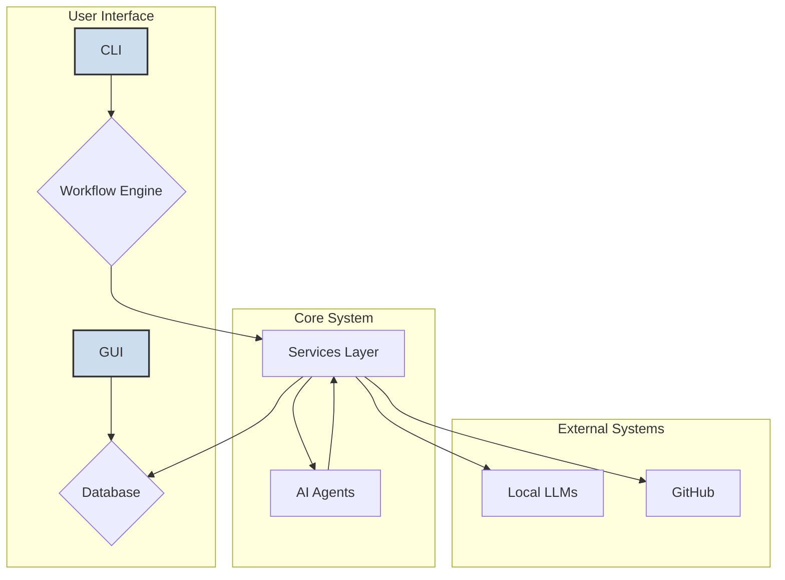
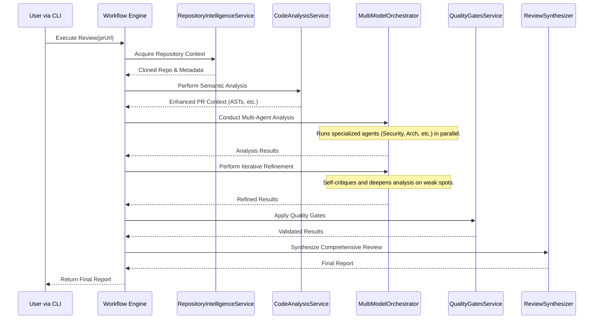

# Hikma-PR: Software Architecture Document

*This document was generated by Gemini to provide a comprehensive overview of the Hikma-PR project architecture.*

## 1. Introduction

Hikma-PR is a sophisticated, stateful CLI application designed to automate the review of GitHub Pull Requests. Its core mission is to leverage the power of local Large Language Models (LLMs) to provide in-depth, multi-faceted code analysis without relying on cloud-based services like OpenAI or Claude.

The system is architected to be modular, extensible, and resilient. It uses a graph-based workflow engine to orchestrate a series of specialized "agents," each responsible for a different aspect of the review (e.g., security, performance, architecture). This document outlines the key components, workflows, and design patterns that make up the Hikma-PR application.

## 2. High-Level Architecture

At a high level, the system is composed of several distinct layers:

-   **CLI (Command-Line Interface)**: The user-facing entry point, built with `commander.js`. It handles user commands like `review`, `resume`, and `reports`.
-   **Workflow Engine (LangGraph)**: The core of the application. It uses a stateful graph (`StateGraph`) to manage and orchestrate the entire review process, making it resilient and resumable.
-   **Service Layer**: A collection of decoupled services that perform specific tasks such as interacting with GitHub, communicating with LLMs, chunking code, and gathering repository intelligence.
-   **AI Agents**: A team of specialized AI agents, each powered by a potentially different LLM, that analyze the code from a specific perspective (e.g., `SecurityAnalysisAgent`, `ArchitecturalAnalysisAgent`).
-   **Persistence Layer (Prisma)**: A database layer that stores the state of ongoing reviews, enabling the `resume` functionality and providing a data source for reports and the GUI.
-   **GUI (Next.js)**: A web-based interface for visualizing review results, which reads data from the persistence layer.

## 3. The Comprehensive Review Workflow

The heart of Hikma-PR is the **Comprehensive Review Workflow**, an advanced, multi-stage pipeline that ensures a deep and thorough analysis of a pull request. This workflow is orchestrated by a `StateGraph` defined in `src/graph/workflow.ts`.

The following diagram illustrates the sequence of operations:

### Workflow Stages Explained:

1.  **Phase 1: Deep Context Acquisition**: The `RepositoryIntelligenceService` clones the target repository. It then builds a `CodebaseMap`, which includes the directory structure, file types, languages used, and architectural patterns detected. This provides a holistic view of the project.

2.  **Phase 2: Semantic Analysis**: The `CodeAnalysisService` takes over, parsing the code into Abstract Syntax Trees (ASTs). It uses this to perform a deep semantic analysis, identifying function signatures, type definitions, dependency chains, and data flows. This stage creates "semantic chunks" of code that are more meaningful than simple line-based chunks.

3.  **Phase 3: Multi-Agent Analysis**: The `MultiModelOrchestrator` dispatches tasks to a team of specialized agents (`ArchitecturalAnalysisAgent`, `SecurityAnalysisAgent`, etc.). Each agent is an expert in its domain and uses a specifically configured LLM to analyze the code. The system performs cross-validation by comparing the results from different agents to identify agreements and disagreements.

4.  **Phase 4: Iterative Refinement**: The system enters a self-critique loop. It analyzes its own initial findings, identifies areas of low confidence or potential gaps, and triggers a deeper, more targeted analysis on those specific areas. This process repeats until the analysis converges or reaches a predefined iteration limit.

5.  **Phase 5: Quality Gates**: The `QualityGatesService` and `QualityScoringSystem` evaluate the refined analysis against a set of quality standards. It checks for completeness, consistency, actionability, and evidence. A comprehensive quality score is calculated.

6.  **Phase 6: Comprehensive Synthesis**: Finally, the `ReviewSynthesizer` (or `QualityReportingService`) generates a final, human-readable report, including an executive summary, a list of prioritized recommendations, and detailed breakdowns for various stakeholders.

## 4. Key Architectural Components

### a. State Management (Prisma)

The application uses **Prisma** as its ORM to interact with a database. This is a critical component for two reasons:
1.  **Stateful Workflows**: The state of each step in the `StateGraph` is saved to the database.
2.  **Resilience**: If the review process is interrupted (e.g., network error, LLM failure), it can be resumed from the last saved state using the `hikma resume <task_id>` command.

The schema is defined in `prisma/schema.prisma` and includes models for `Review`, `Finding`, `Recommendation`, and more.

### b. Service Layer (`src/services/`)

This layer abstracts the core logic into decoupled, reusable services.

-   **`UniversalLLMClient`**: This is the cornerstone of the local-first strategy. It provides a single, OpenAI-compatible interface for interacting with various local LLM servers like **LM Studio**, **Ollama**, and **vLLM**. It is configured via `src/config/llmConfig.ts`.
-   **`AnalysisService`**: This service orchestrates the 4-pass analysis on each code chunk. For a single piece of code, it runs sequential analyses for: 1) Syntax & Logic, 2) Security & Performance, 3) Architecture & Design, and 4) Testing & Docs.
-   **`ChunkService`**: Before code is sent to an LLM, this service breaks it down into smaller, semantically-aware chunks. This is crucial for models with limited context windows.
-   **`FileFilterService`**: Not all files in a PR are worth reviewing (e.g., lock files, minified code, test snapshots). This service uses configurable rules to intelligently filter the file list down to what matters.
-   **`RepositoryIntelligenceService`**: This service is responsible for Phase 1 of the workflow. It clones the repo and gathers all the necessary context to enable a deep, context-aware review.

### c. Agent-Based System (`src/agents/`)

Hikma-PR employs an agent-based architecture. Instead of using one monolithic prompt, it uses a team of specialized agents.

-   **`ArchitecturalAnalysisAgent`**: Focuses on system design, patterns, and quality.
-   **`SecurityAnalysisAgent`**: Focuses on vulnerabilities and threat assessment.
-   **`PerformanceAnalysisAgent`**: Focuses on bottlenecks and efficiency.
-   **`TestingQualityAgent`**: Focuses on test coverage and quality.

This design is highly **extensible**. A new type of analysis can be added simply by creating a new agent that conforms to the `AnalysisAgent` interface.

### d. Dynamic Prompt Engineering (`src/prompts/`)

This is one of the most advanced features of the system. Prompts are not static strings. The `DynamicPromptBuilder` and `ContextAwareEnhancer` work together to construct highly-contextualized prompts tailored to the specific repository and code changes being reviewed.

For example, when generating a prompt for the `ArchitecturalAnalysisAgent`, the system will inject specific guidance based on the project's detected language (e.g., TypeScript), framework (e.g., React), and architecture (e.g., Microservices). This ensures the LLM's response is far more relevant and accurate.

## 5. GUI (`hikma-pr-gui/`)

The project includes a separate Next.js application that serves as a graphical user interface. It connects to the same Prisma database used by the CLI tool, allowing users to view the results of a review in a more user-friendly, web-based format.

## 6. Conclusion

The Hikma-PR architecture is designed for depth, resilience, and extensibility. By combining a stateful graph workflow, a multi-agent system, and dynamic, context-aware prompt engineering, it provides a powerful framework for conducting automated code reviews using local LLMs. Its modular design allows for continuous improvement and adaptation to new technologies and analysis techniques.
